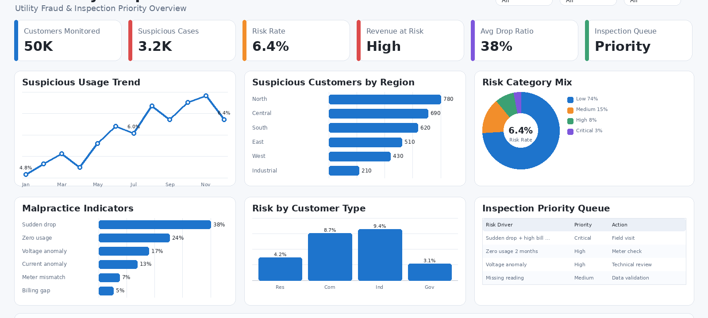

# Electricity Malpractice Detection Analysis

End-to-end analytics project to detect electricity theft, meter tampering, and billing irregularities using consumption deviation analysis, machine learning classification, and Power BI dashboards — designed to help utility providers prioritise field inspection resources.

**Stack:** SQL · Python · scikit-learn · Power BI  
**Domain:** Utilities · Anomaly Detection · Operational Analytics

---

## Business Problem

Electricity providers lose significant revenue through meter tampering, illegal bypasses, and billing manipulation. Manual inspection is expensive and inefficient when applied without data-driven prioritisation. This project identifies high-risk customers using consumption pattern analysis — so inspection teams can focus effort where it matters most.

---

## Dataset

| Attribute | Value |
|---|---|
| Source | Kaggle (electricity consumption dataset) |
| Data Type | Customer-level monthly meter readings |
| Key Variables | Customer ID, region, customer type, monthly consumption, billing status, fraud label |

---

## Project Structure

```
├── data/
│   └── raw/                                          # Source electricity consumption data
├── notebooks/
│   └── electricity_malpractice_analysis.ipynb        # EDA, feature engineering, ML model
├── sql/
│   └── electricity_analysis_queries.sql              # KPI queries and risk classification
├── models/
│   └── random_forest_model.pkl                       # Saved trained model
├── powerbi/
│   ├── Electricity-malpractise-reading-dashboard.png # Executive dashboard screenshot
│   └── Electricity-gas-malpractice.png               # Fraud analysis dashboard screenshot
├── reports/
│   └── analysis_report.html                          # Exported notebook report
└── README.md
```

---

## Tech Stack

| Tool | Purpose |
|---|---|
| SQL | Data extraction, KPI queries, risk classification |
| Python (pandas, NumPy) | Data cleaning, EDA, feature engineering |
| scikit-learn | Random Forest classifier, model evaluation |
| Power BI + DAX | Executive and fraud analysis dashboards |

---

## Feature Engineering

Risk features engineered relative to each customer's own historical baseline:

| Feature | Description |
|---|---|
| `avg_customer_consumption` | Customer's historical average monthly consumption |
| `consumption_drop_ratio` | Current reading as a ratio of the customer's own average |
| `sudden_drop_flag` | Binary flag when consumption drops below threshold vs baseline |
| `high_usage_flag` | Flag for abnormally high consumption vs baseline |
| `month` | Month of reading (captures seasonality) |
| `year` | Year of reading |

> Deviation from a customer's own baseline is more powerful than absolute thresholds — it accounts for legitimate variation across customer types and regions.

---

## Machine Learning Model

**Algorithm:** Random Forest Classifier  
**Why Random Forest:** Handles non-linear relationships between features, robust to outliers, provides feature importance scores, works well on structured tabular data with class imbalance.

**Evaluation Metrics:** Precision · Recall · F1 Score · Confusion Matrix

> In malpractice detection, **recall** is prioritised over accuracy — missing a genuine fraud case causes ongoing revenue loss, whereas a false alarm results in a single field visit.

---

## Power BI Dashboards

### Executive Summary
Total customers, total consumption, fraud customer count, overall fraud rate, and suspicious customer breakdown.

[

### Fraud Analysis
Fraud concentration by region, customer type, and month — with risk level breakdown for inspection prioritisation.

[
[

---

## Key Insights

1. Fraud cases are geographically clustered in specific regions — not evenly distributed — suggesting infrastructure vulnerability or enforcement gaps in those areas.
2. Commercial customers carry significantly higher fraud risk than residential customers, reflecting larger financial incentives for manipulation.
3. Sudden consumption drops are the strongest single indicator of malpractice — the `consumption_drop_ratio` feature consistently ranked highest in model feature importance.
4. Combining consumption behaviour with customer profile data is substantially more predictive than either alone.

---

## Business Impact

This analysis enables utility providers to:
- Rank customers by fraud risk score and prioritise inspection queues accordingly
- Allocate field teams geographically by regional fraud concentration
- Detect suspicious patterns earlier — before complaints or billing disputes arise
- Build a scalable, data-driven monitoring layer on top of existing billing systems

---

## Getting Started

```bash
pip install pandas numpy scikit-learn matplotlib seaborn jupyter

jupyter notebook notebooks/electricity_malpractice_analysis.ipynb
```

---

## Author

**Revathy Shanmugaraj** · [github.com/Revashan](https://github.com/Revashan)
